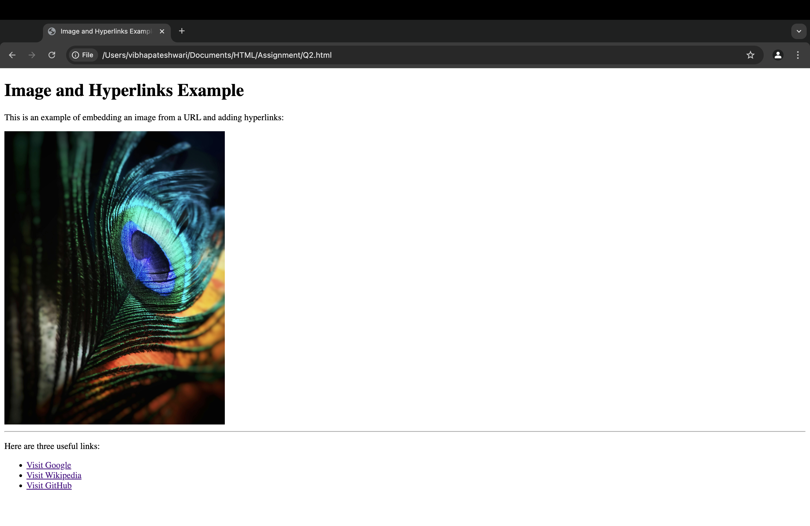

## Exercise 2: Hyperlinks and Images

### Question
Create a webpage that demonstrates:
* At least three hyperlinks to different pages
* An image using the `` tag
* Making the image clickable to redirect users to another webpage

### Solution
The solution uses HTML5 to create a webpage with multiple hyperlinks and an embedded image:
* `<a href="...">` tags for creating hyperlinks to external websites
* `target="_blank"` attribute to open links in new tabs
* `` tag to display an image with appropriate attributes:
  * `src` attribute for the image URL
  * `alt` attribute for accessibility
  * `width` attribute to control image size
* Organized links in an unordered list `<ul>` with list items `<li>`

### Output
The webpage displays a heading "Image and Hyperlinks Example" followed by explanatory text. It shows a peacock feather image from Pexels. Below a horizontal rule, there's a list of three hyperlinks to Google, Wikipedia, and GitHub, each opening in a new tab when clicked.

