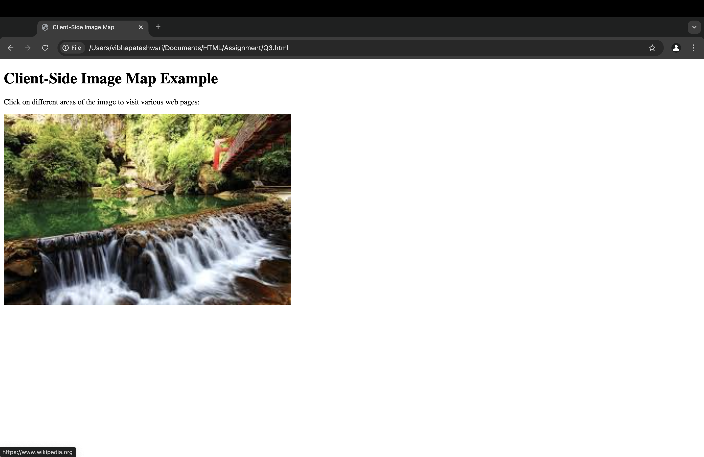

## Exercise 3: Client-Side Image Mapping

### Question
Use the client-side image map feature in HTML5 to create clickable areas on an image.  
* Clicking on different parts of the image should take the user to different web pages.

### Solution
The solution uses HTML5 and the `<map>` element to define clickable areas on an image:  
* The `` tag includes a `usemap` attribute linking to the `<map>` element.  
* The `<map>` element contains multiple `<area>` tags, each defining a clickable region:
  * `shape="rect"`, `shape="circle"`, and `shape="poly"` define different shapes.
  * `coords` attribute specifies coordinates for clickable areas.
  * `href` attribute provides destination URLs.
* The `alt` attribute ensures accessibility.

### Output
The webpage displays a heading **"Client-Side Image Map Example"** followed by an image of a world map.  
Clicking on different regions redirects users to different web pages.

