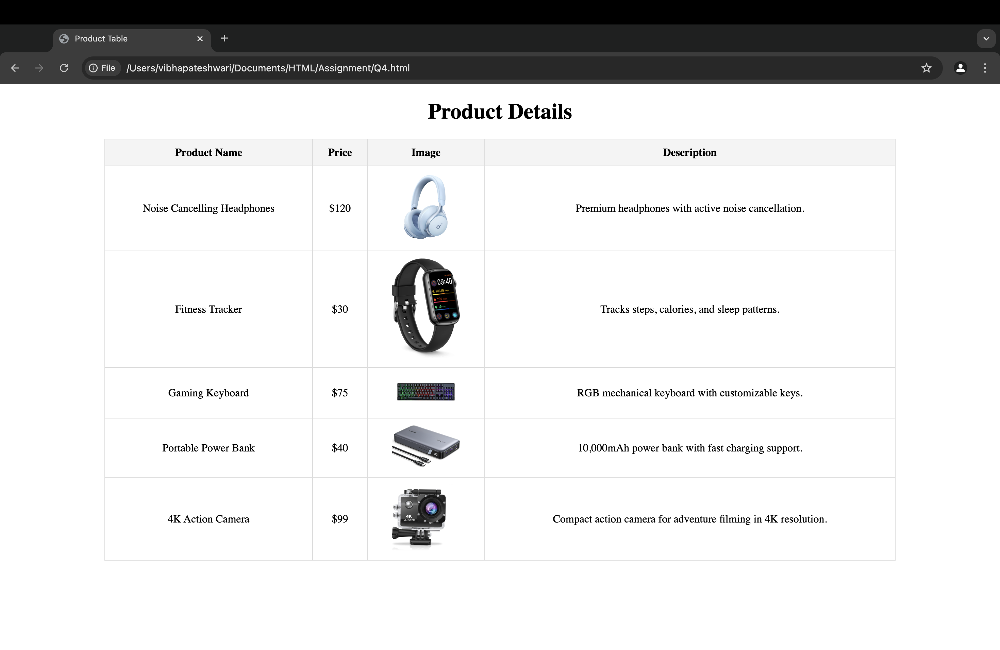

## Exercise 4: Creating a Web Page Layout with a Table

### Question
Design a webpage using the `<table>` tag.  
* Use rows and columns to display product details like product name, price, image, and description in a structured manner.

### Solution
The solution uses HTML5 and the `<table>` element to organize product details:  
* The `<table>` tag creates a structured grid layout.
* `<tr>` defines table rows, and `<th>`/`<td>` create headers and data cells.
* The `border-collapse: collapse;` CSS property ensures clean table borders.
* Images are displayed within table cells using the `` tag.

### Output
The webpage displays a heading **"Product Table"** followed by a structured table with product details, including images, names, prices, and descriptions.

