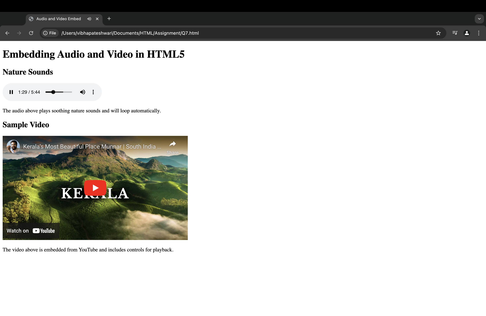

## Exercise 7: Adding Audio and Video in HTML5

### Question
Embed multimedia content into a webpage:  
* An **audio file** that plays background music.  
* A **video file** with controls such as play, pause, and volume adjustment.

### Solution
The solution uses HTML5 `<audio>` and `<video>` elements:  
* `<audio>` embeds a background music file with:
  * `controls` attribute to display play/pause buttons.
  * `autoplay` and `loop` attributes for continuous playback.
* `<video>` embeds a video file with:
  * `controls` attribute for play, pause, volume, and fullscreen.
  * `width="100%"` ensures responsiveness.

### Output
The webpage displays a **"Multimedia Example"** section with an embedded **audio player** for background music and a **video player** with playback controls.

