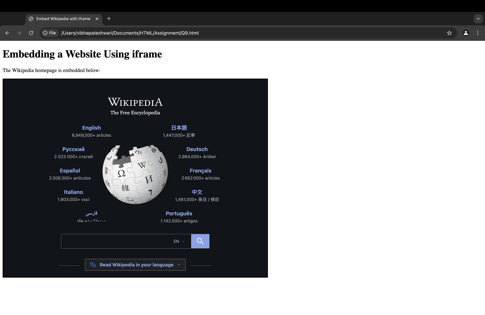

## Exercise 9: Using `<iframe>` to Load Another Website

### Question
Design a webpage that includes an `<iframe>` element to embed a different website,  
such as displaying a **Google search page** within your webpage.

### Solution
The solution uses an HTML5 `<iframe>` element to embed an external website:  
* The `<iframe>` tag includes:
  * `src="https://www.wikipedia.org"` to load the Wikipedia homepage.
  * `width="800px"` and `height="600px"` to control the display size.
  * `style="border: 2px solid black;"` to add a visible border.
* The **sandbox** attribute can be used for security to limit interactions with embedded content.

### Output
The webpage displays a **"Embedded Website Example"** section with an `<iframe>` showing the Wikipedia homepage inside the webpage.

