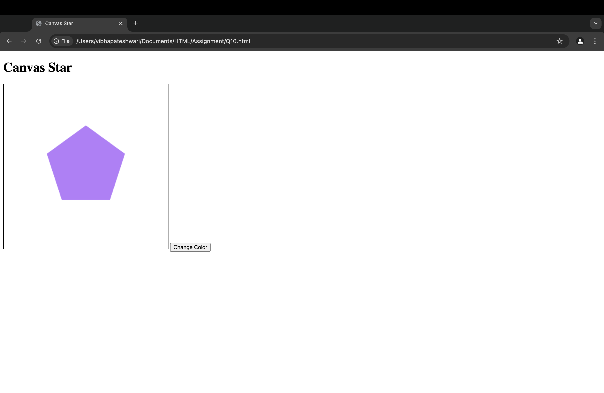

## Exercise 10: HTML5 Canvas Drawing

### Question
Use the **HTML5 Canvas API** to draw basic shapes like:  
* A **rectangle, circle, and line** on a webpage.  
* Add a simple **JavaScript function** to dynamically change the shape colors.

### Solution
The solution uses the `<canvas>` element and JavaScript:  
* `<canvas>` creates a drawing area with `id="canvas"`.  
* The `getContext("2d")` method initializes a 2D drawing context.  
* The `fillRect()`, `arc()`, and `moveTo()/lineTo()` methods draw shapes.  
* A JavaScript function allows users to change the colors dynamically by clicking a button.

### Output
The webpage displays a **"Canvas Drawing Example"** section, showing a **rectangle, circle, and line** drawn on the canvas. A **button** allows users to change shape colors.

